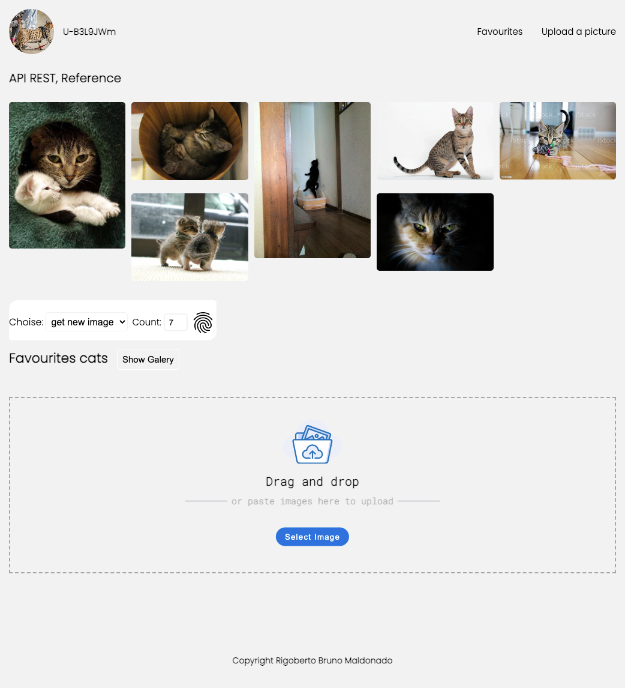

------------

# cat-api-rest


<p align="center">
  
</p>


```css
.container_favourites {
    margin-top: 1.5rem;
    justify-content: center;
    columns: 5 150px;
    column-gap: 10px;
}

.container {
    position: relative;
}

.container:hover .gradient_img{
    content: '';
    position: absolute;
    top: -10px;
    background: linear-gradient(to top, rgba(0, 0, 0, 1) 0%, rgba(0, 0, 0, 0) 55%);
    background-size: 100% 100%;
    width: 100%;
    height: 100%;
    border-radius: 0.5rem;
    
  }

.macro_image {
    width: 100%;
    border-radius: 0.5rem;
    margin-bottom: 10px;
}
```

<p align="center">
  
</p>

------------


------------
Visit the site here 👉  ... [brunomaldonado](https://brunomaldonado.github.io/cat-api-rest/ "Visit the site here brunomaldonado")

------------
